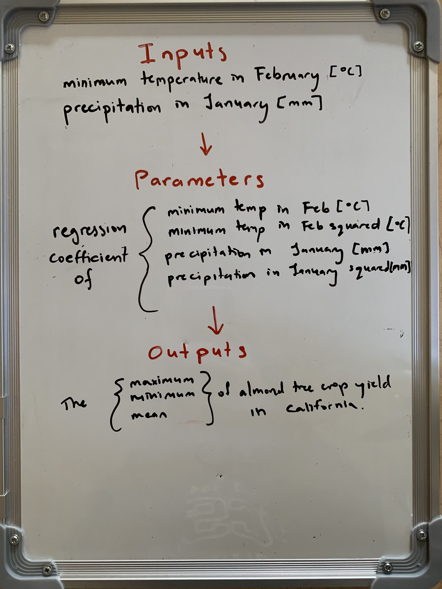

# Almond Yield Anomaly Function

Lobell et. al, 2006  used data to build models of tree crop yield for California that captured how climate variation (place and time) might influence yield.

For this assignment, we implemented a simple model of almond yield anomaly response to climate based on this equation where Y = almond yield (in tons per acre):

$$
Y = -0.015 T _{n,2} - 0.0046 T _{n,2} ^2 - 0.07 P _1 + 0.0043 P _1 ^2 + 0.28
$$

## Model diagram



## Function code and application

```{r}
# Load libraries
library(tidyverse)
```

```{r}
# Import climate data
clim <- read_delim(here::here("week2", "data", "clim.txt"))
```

```{r}
# Source the function
source(here::here("week2", "R", "almond_yield.R"))
```

```{r}
# Call the function
almond_yield_results <- almond_yield(clim = clim)
```

```{r}
# Create almond yield anomaly function
almond_yield <- function(clim, t1 = -0.015, t2 = -0.0046, p1 = -0.07, p2 = 0.0043, c = 0.28) {
  
  # Find minimum Februrary temperature for each year
  min_temp_feb <- clim %>%
    filter(month == 2) %>%
    group_by(year) %>%
    summarise(feb_min_temp = mean(tmin_c)) %>%
    ungroup()
  
  # Find January precipitation total for each year
  precip_jan <- clim %>%
    filter(month == 1) %>%
    group_by(year) %>%
    summarise(jan_precip = sum(precip)) %>%
    ungroup()
  
  # Join climate variables
  joined <- left_join(min_temp_feb, precip_jan)
  
  # Calculate almond yield using climate variables
  results <- joined %>%
    mutate(yield = 
             t1*feb_min_temp + 
             t2*feb_min_temp^2 + 
             p1*jan_precip + 
             p2*jan_precip^2 +
             c)
  
  # Calculate yield anomalies
  results <- results %>%
    summarise(min_yield = min(yield), max_yield = max(yield), mean_yield = mean(yield))
}
```
